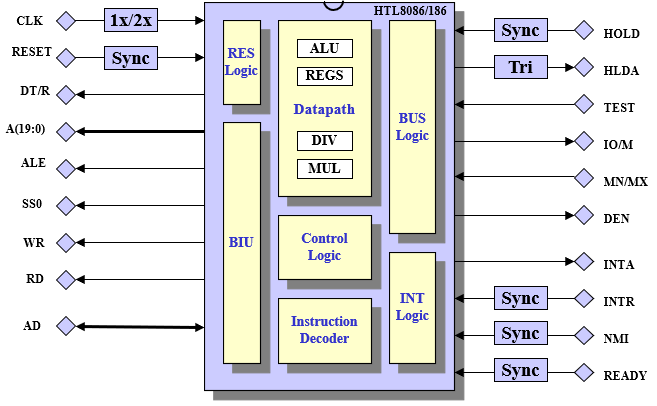
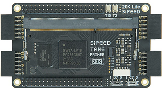
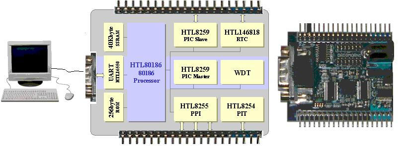

# HTL80186: 80186/88 Compatible microprocessor in VHDL





# 1. Introduction

The HTL80186 is an instruction set compatible 80186/80188 microprocessor. The processor is written in vendor neutral VHDL and can be synthesized for either ASIC or FPGA implementation.

Note: the HTL80186 core does not include any of the original 80186/80188 peripherals, it is a micro processor core like the 8086/8088.

For a bus compatible RTC see [github page](https://github.com/htminuslab/HTL146818).

# 2. Directory Structure

The github directory structure is as follows:

| **Directory** | **Contents** |
| --- | --- |
| HTL80186\bin | Any executable files such as memory image creation utilities |
| HTL80186\doc | Documentation |
| HTL80186\rtl | Synthesisable 16bits Core files |
| HTL80186\rtl\I80188 | Synthesisable 8bits Core (top level only) |
| HTL80186\testbench | Testbench files for the 16bits 80186 |
| HTL80186\Modelsim | Example script for Modelsim |
| HTL80186\Modelsim\FreeDOS | Example script for loading FreeDOS under Modelsim |
| HTL80186\synthesis | Gowin example synthesis batch file |
| HTL80186\software | Example assembly programs |

# 3. Filelist

The HTL80186 design is contained in 22 VHDL files, the dependency order is listed in the file **filelist.txt**.

| **Filename(s)** | **Contains** |
| --- | --- |
| a_table.vhd
 d_table.vhd
 m_table.vhd
 n_table.vhd
 r_table.vhd
 formatter_rtl.vhd | Instruction Decoding Logic |
| cpu86instr.vhd
 cpu86pack.vhd | Main Package |
| alu_rtl.vhd
 multiplier_rtl.vhd
 divider_rtl_ser.vhd | ALU Logic |
| dataregfile_rtl.vhd
 segregfile_rtl.vhd
 ipregister_rtl.vhd
 datapath_rtl.vhd | Datapath logic |
| proc_rtl.vhd | Control Path logic |
| newbiufsm_fsm.vhd
 newbiushift_rtl.vhd
 newbiu_rtl.vhd | Bus Interface Unit |
| biuirq_rtl.vhd
 rise_edge.vhd | Interrupt and vector logic |
| cpu188_rtl.vhd | Top Level 8 bits core |
| cpu186_rtl.vhd | Top Level 16 bits core |

The basic testbench for the 80186 consist of 4 files:

| **Filename(s)** | **Contains** |
| --- | --- |
| sram_behavior | sram memory model **Note1** |
| port_mon.vhd | I/O Port 0x54 monitor, used for STDOUT function |
| utils.vhd | Support functions |
| cpu186_tb.vhd | 80186 Testbench |

**Note1** : Free download from [http://tams-www.informatik.uni-hamburg.de/vhdl/models/sram/sram.html](http://tams-www.informatik.uni-hamburg.de/vhdl/models/sram/sram.html)

A further 5 files are provided for the FreeDOS demo.

| **Filename(s)** | **Contains** |
| --- | --- |
| loadfnamed.dat | BIOS Memory image, source not supplied |
| loadflash0.dat | FreeDOS 360Kbyte floppy image, source not supplied |
| bootstrap.vhd | 256byte ROM module containing just a single jump instruction |
| demo188.vhd | HTL80186 configured as an 80188 plus some decoding logic |
| demo188_tb.vhd | Testbench for the FreeDOS demo |

**Note** : FreeDOS is a free Microsoft® MS-DOS compatible operating system, see [http://www.freedos.org/](http://www.freedos.org/)

# 4. Simulation

The HTL80186 is written in synthesisable VHDL and as such can be simulated by any simulation tools.

An example simulation script is provided for Mentor Graphics' Modelsim. To run the simulation navigate to the Modelsim directory and execute the **run.bat** file from within a DOSbox/CMD shell. Alternative, execute the **run.do** file from within Modelsim.

The output in both cases should be similar to the text shown below.
```
# vsim -c i80186.cpu186_tb -do "set StdArithNoWarnings 1; run 300 us; quit"
# Start time: 19:31:45 on May 16,2023
# //  ModelSim DE-64 2023.2 Apr 11 2023
# //
# //  Copyright 1991-2023 Mentor Graphics Corporation
# //  All Rights Reserved.
# //
# set StdArithNoWarnings 1
# 1
#  run 300 us
# Loading SRAM from file loadproml.dat ...
# Loading SRAM from file loadpromh.dat ...
# Initializing SRAM with zero ...
# Loading SRAM from file loadsraml.dat ...
# Initializing SRAM with zero ...
# Loading SRAM from file loadsramh.dat ...
# ** Note: ********** HTL80186 ver 1.6
#    Time: 374 ns  Iteration: 2  Instance: /cpu186_tb/I0
# PORT_MON : *** Hello World ***
#  quit
# End time: 19:31:46 on May 16,2023, Elapsed time: 0:00:01
# Errors: 0, Warnings: 0
```

The demo simulation consist of a simple "hello world" program (software\hello.asm) that writes a string of characters to a fixed output port (0x54). A port monitor (testbench\port_mon.vhd) displays the received characters in the Modelsim transcript window.

**# PORT_MON : \*\*\* Hello World \*\*\***

The testbench instantiates the HTL80186 processor, the Port Monitor and four 8 bits SRAM memory models.

Two SRAM models are used for the 16 bits ROM (ROML/ROMH) occupying the top 4Kbyte of the 80186 1Mbyte memory map. The ROML/ROMH memory is filled with a simple jump to 0080:0100 instruction (see software\jump0900.asm). After reset the processor starts executing at FFFF:0000 and will execute the simple jump instruction.

The 16 bits user memory is located in the final two SRAM models (RAML/RAMH) and occupies the bottom 256Kbyte of the 80186 1Mbyte memory map.

To change the ROM contents invoke the **rom.bat** batch file. This file uses the free NASM assembler (not supplied, see [http://sourceforge.net/projects/nasm/](http://sourceforge.net/projects/nasm/)) and a ROM image conversion program **bin2memw.exe** (see bin directory). The NASM assembler converts the assembly program into a binary image (tiny memory model, 64K for both code and data) which is then translated to a memory image file than can be read by the SRAM model (see testbench\sram_behavior.vhd).

nasm -f bin -l jump0900.lst -o jump0900.bin jump0900.asm
 bin2memw.exe jump0900.bin loadprom 0000:0000

The resulting **loadproml.dat** and **loadpromh.dat** (two 8 bits files for even and odd byte respectively) are loaded into memory during simulation. Note the 0000:0000 command line arguments is the SEGMENT:OFFSET address. This value should be zero since it is the offset from the bottom of the ROM area.

A user program can be loaded anywhere in the bottom 256Kbyte. The procedure to create a new memory image is similar as described above. A program is assembled and translated into a memory image by bin2memw.exe.

```
nasm -f bin -l hello.lst -o hello.com hello.asm
bin2memw.exe hello.com loadsram 0080:0100
```

Note the 0080:0100 which is the same values as jump to in the jump0900.asm program (jump to after reset).

For the 8bits 80188 the **bin2mem.exe** (see bin directory) can be used. This program creates a single 8bits memory image. No testbench is supplied for the 80188.

### 4.1 FreeDOS Demo

The Modelsim\FreeDOS directory contains a demo that shows the HTL80186 booting FreeDOS under Modelsim.

The simulation needs to run for approximately 2.3 seconds in order to boot FreeDOS and to process some commands contained in the AUTOEXEC.BAT file. Under Questa Core with VOPT enabled and no logging of signals (nolog –r \*) this takes about 15 minutes on a 3.6GHz PC.

### 4.1.1 How does the demo work?

The testbench demo188_tb.vhd consist of the HTL80186 processor (configured as an 80188), 1Mbyte SRAM for the main memory and 512Kbyte SRAM used for a RAMDisks. The RAMDisk is memory mapped to address E0000:EFFFF. The paging or bankswitch register is located at I/O address 0x55. By changing the paging register different 64KByte blocks can be "mapped" into the main memory.

At the start of simulation a 4Kbyte BIOS image (loadfnamed.dat) is loaded at the top of the memory map at address FF00:0000, a FreeDOS 1.0 360Kbyte floppy image is loaded into the bankswiched 512Kbyte memory.

The reset vector is located in a small 256Bytes ROM look-up-table (bootstrap.vhd) and points to the start address of the BIOS. The BIOS sets up some interrupt vectors, initialises some variables in the BDA (BIOS Data Area) followed by executing INT19.

The INT13 harddisk/floppy I/O calls have been modified to move 512 byte sectors from the floppy image into the main memory. The I/O write calls are not implemented.

The BIOS source is not supplied with the HTL80186.

The INT10 output calls are directed to I/O port 0x54 which is monitored by the port_monitor module. The keyboard input INT16 calls are not implemented. Any characters written under FreeDOS are displayed in the Modelsim transcript window as is shown below.

```
# vsim -c i80186.demo188_tb -do "set StdArithNoWarnings 1; run 2300 ms"
# Start time: 08:31:01 on May 16,2023
# //  ModelSim DE-64 2023.2 Apr 11 2023
# //
# //  Copyright 1991-2023 Mentor Graphics Corporation
# //  All Rights Reserved.
# //
# set StdArithNoWarnings 1
# 1
#  run 2300 ms
# Loading SRAM from file loadflash0.dat ...
# Initializing SRAM with zero ...
# Loading SRAM from file loadfnamed.dat ...
# ** Note: ********** HTL80188 ver 1.6
#    Time: 604 ns  Iteration: 2  Instance: /demo188_tb/U_0/U_0
# ** Note: ********** Copyright (c) 2003-2017 HT Lab WWW.HT-LAB.COM
#    Time: 604 ns  Iteration: 2  Instance: /demo188_tb/U_0/U_0
# PORT_MON : BIOS186 80188/80186 Bios ver 1.0x
# PORT_MON :      (c)HT-LAB 2005-2009
# PORT_MON :      All rights reserved.
# PORT_MON :
# PORT_MON : Config IO Port         : 0x01
# PORT_MON : Memory in Kbyte        : 640
# PORT_MON : Flash Image C,H,S      : 40,02,09
# PORT_MON : Booting......
# PORT_MON : FreeDOS123
# PORT_MON : FreeDOS kernel build 2038 [version May 16, 2009 compiled May 17 2009]
# PORT_MON : Kernel compatibility 6.22 - WATCOMC
# PORT_MON :
# PORT_MON : (C) Copyright 1995-2006 Pasquale J. Villani and The FreeDOS Project.
# PORT_MON : All Rights Reserved. This is free software and comes with ABSOLUTELY NO
# PORT_MON : WARRANTY; you can redistribute it and/or modify it under the terms of the
# PORT_MON : GNU General Public License as published by the Free Software Foundation;
# PORT_MON : either version 2, or (at your option) any later version.
# PORT_MON :  - InitDiskno hard disks detected
# PORT_MON :
# PORT_MON : FreeCom version 0.82 pl 3 [Feb 14 2009 11:48:00]
# PORT_MON :
# PORT_MON : A:\>dir/w
# PORT_MON :  Volume in drive A has no label
# PORT_MON :  Volume Serial Number is 234B-11F2
# PORT_MON :  Directory of A:\
# PORT_MON :
# PORT_MON : KERNEL.SYS     COMMAND.COM    AUTOEXEC.BAT   DEBUG.COM      CPULEVEL.COM
# PORT_MON : PORT50.COM
# PORT_MON :          6 file(s)        154,338 bytes
# PORT_MON :          0 dir(s)          98,304 bytes free
# PORT_MON :
# PORT_MON : A:\>cpulevel
# PORT_MON : CPULEVEL - public domain by Eric Auer 2004-2008
# PORT_MON : 80186 or compatible 16bit CPU found.
# PORT_MON :
# PORT_MON : A:\>memory
# PORT_MON : Environment segment    : max   256 bytes; free   223 bytes
# PORT_MON : Context segment        : max  2048 bytes; free  2030 bytes
# PORT_MON :         Aliases        : limit  1024 bytes, current     5 bytes,     0 items
# PORT_MON :         History        : limit   256 bytes, current     0 bytes,     0 items
# PORT_MON :         Directory stack: limit   256 bytes, current     5 bytes,     0 items
# PORT_MON :         Last dir cache : used      0 bytes,     0 items
# PORT_MON :         Swapinfo       : used      0 bytes,     0 items
# PORT_MON : Heap                   : free  7984 bytes
# PORT_MON :
# PORT_MON : *** FINISH ***
# PORT_MON :
VSIM 3> exit
# End time: 08:49:49 on May 16,2023, Elapsed time: 0:18:48
# Errors: 0, Warnings: 0
```
The copyright notice can be ignored.

Please note that this is just a demo, apart from displaying the boot process, loading of FreeDOS and any executing any task/programs listed in the autoexec.bat file there is not much else you can do with it. There is no console input although there is no reason why this can't be added (it will be slow....). 

# 5. Synthesis

The HTL80186 can be synthesized using any synthesis tool. The area and delay figures will depends on the used synthesis tool and synthesis constraints. 

An example synthesis script for the *Gowin GW2A-18C* is provided. 

To run the synthesis, edit the **run.bat** file and correct the path to the Gowin command shell *(<install_path>\IDE\bin\gw_sh.exe)*. 
Next open a Windows CMD prompt, navigate to the Synthesis directory and execute **run.bat**.



```
3. Resource Usage Summary

  ----------------------------------------------------------
  Resources                   | Usage
  ----------------------------------------------------------
  Logic                       | 5805/20736  28%
    --LUT,ALU,ROM16           | 5805(5475 LUT, 330 ALU, 0 ROM16)
    --SSRAM(RAM16)            | 0
  Register                    | 761/16173  5%
    --Logic Register as Latch | 0/15552  0%
    --Logic Register as FF    | 736/15552  5%
    --I/O Register as Latch   | 0/621  0%
    --I/O Register as FF      | 25/621  5%
  CLS                         | 3366/10368  33%
  I/O Port                    | 83
  I/O Buf                     | 83
    --Input Buf               | 24
    --Output Buf              | 59
    --Inout Buf               | 0
  IOLOGIC                     | 0%
  BSRAM                       | 0%
  DSP                         | 7%
    --MULT18X18               | 1
    --MULTADDALU18X18         | 1
  PLL                         | 0/4  0%
  DCS                         | 0/8  0%
  DQCE                        | 0/24  0%
  OSC                         | 0/1  0%
  CLKDIV                      | 0/8  0%
  DLLDLY                      | 0/8  0%
  DQS                         | 0/9  0%
  DHCEN                       | 0/16  0%
  ==========================================================

2.3 Max Frequency Summary
  NO.   Clock Name   Constraint    Actual Fmax   Level   Entity  
 ===== ============ ============= ============= ======= ======== 
  1     clk          40.000(MHz)   40.205(MHz)   21      TOP     
```


# 6. Pin Description

| **Symbol** |**Type** | **Function** |
| --- | --- | --- |
| CLK | I | Clock Input Signal **Note1** |
| POR | I | Active high Power On Reset Signal |
| RESOUTN | O | Active low reset output synchronised to CLK |
| WRN | I | Active low Write strobe |
| RDN | I | Active low Read strobe |
| ALE | I | Address Latch Enable |
| READY | I | Active high Bus Termination Signal **Note5, 2** |
| ABUS(23:0) | I | 24 bits Address Bus **Note7** |
| DBUS_OUT(15:0) | O | Databus output **Note4** |
| DBUS_IN(15:0) | I | Databus input **Note4** |
| BHE | O | Bus High Enable Signal **Note3** |
| HOLD | I | Bus Request Signal **Note6** |
| HLDA | O | Bus Request Acknowledge Signal |
| PROC_ERROR | O | Processor detected an illegal instruction |
| NMI | I | Non Maskable Interrupt Input **Note6** |
| INTR | I | Maskable Interrupt Input **Note6** |
| LOCK | O | Bus Lock Output signal |
| TEST | I | CoProcessor TEST input signal **Note6** |
| S(6:0) | O | Bus Interface Status Signal |
| QS(1:0) | O | PreFetch Queue Signal |
| IRET | O | Active High when an IRET instruction is being executed **Note8** |
| TURBO186 | I | Extended Addressing Mode enable |

**Note1** : All actions are on the Rising Edge of the clock signal.

**Note2** : Ready must be negated (low) before the rising edge of T4

**Note3** : Only available on the 80186, asserted when accessing a byte on the upper databus (15:8)

**Note4** : 16bits shown, 7:0 for the 80188. The BUS8 signal can be used to configure the bus (1=188, 0=186)

**Note5** : Connect to VCC when not used

**Note6** : Connect to GND when not used

**Note7** : A23..A21 are only used in the Turbo186 mode

**Note8** : This signal is used for an external DMA Controller

### 6.1 POR/RESOUTN Signals

POR is an active high asynchronous reset signal. The HT80186 generates an asynchronously asserted, synchronously negated reset (internal) and RESOUTN (external) signal.

### 6.2 READY Signal

The HTL80186 bus cycle can be dynamically extended by asserting the **READY** input signal. For READY to be recognised it needs to be asserted (low) before the rising edge of **T4** (end of T3). Note that for the first INTA cycle the READY signal is ignored and the bus cycle remains at 4 clk cycles, only during the second cycle when the vector is read will the bus be extended if READY is asserted.

### 6.2 Proc_Error Signal

The Proc_Error is asserted when the processor encounters an illegal instruction or addressing mode. When the signal is asserted the HTL80186 will execute software interrupt 6 unless the 8086 mode is enabled, in the latter case the processor performs a NOP instruction. Note that INT6 CS:IP will point to the illegal instruction and not to the address after it, thus a straight IRET is incorrect.

### 6.3 Turbo186 Mode

The extended addressing mode was first introduced by Vautomation for their Turbo186 IP cores. Enabling this mode extends the real mode addressing range from 1Mbyte to 16Mbyte. This is achieved by shifting the segment register 1 nibble further to the left before adding the IP register. This mode can be enabled by asserting the turbo186 signal.

| Compatible Mode | Turbo186 Mode |
| --- | --- |
| Example CS=4000, IP=01004000 **0** 0100----- +40100 | Example CS=4000, IP=01004000 **00** 0100------ +400100 |
| Range 00000-FFFFF 1Mbyte | Range 000000-FFFFFF 16Mbyte |

The reset vector for both the Turbo186 and normal mode is 0x0FFFF0. The reset vector value, which is defined in the cpu86pack.vhd file, is used by the Bus Interface Unit only. The CS and IP registers are still 0xFFFF and 0x0000 respectively after reset independent of the selected mode. The I/O address space is still limited to 64Kbyte in turbo186 mode.

The Turbo186 mode is supported by the Paradigm C++ IDE and Micro Digital's SMX real time kernel.

Note that apart from software support it is relative easy to extend the above segment shift to create a 32bits address bus The Turbo186 mode logic can be found in the newbiushift.vhd file.

# 7. Options

The HTL80186 has a number of configurable options:

### 7.1 Bus Width

The Bus Width can be changed from 16 to 8 bits using the **BUS8** signal located on the Bus Interface Module (newbiu, newbiu_struct.vhd).

| **Signal** | **Value** | **Note** |
| --- | --- | --- |
| BUS8 | 0 | 16 bits databus |
| BUS8 | 1 | 8 bits databus. |

**Note** : for the 8 bits databus the byte is written to and read from the lower 8 bits databus (dbus_in(7:0)/dbus_out(7:0)). The BHE signal can be ignored.


### 7.2 8086 Mode

The HTL80186 can be changed to behave like an 8086 processor. The 8086 mode can be enabled by setting the **EN8086** generic on both the PROC and NEWBIU module.

| **Generic** |**Value** | **Note** |
| --- | --- | --- |
| EN8086 | 0 | 80186/80188 |
| EN8086 | 1 | 8086/8088 |

**Note** : setting the EN8086 will not reduce the instruction set to an 8086, the 80186 instructions will still be present and executed correctly.

Changing the EN8086 generic has the following effect:

| **Behavior** |**8086** | **80186** |
| --- | --- | --- |
| Word Read/Write to 0xFFFF | MSByte will wrap to 0x0000 | MSByte will be written to 0x10000 |
| Illegal Instruction | Instruction is ignored | INT6 Trap |
| Shift using CL \> 31 | Shift wraps after 31 | Shifts ignored after 31 |
| ESC instruction | Processed as NOP | INT7 Trap |

# 8. Differences

The following table lists the main differences between the HTL80186 and the original Intel 80186

1. The HTL80186 is a CPU core only, none of the peripherals are supplied as standard.
2. The HTL80186 is not cycle accurate, this means that timing delays which are based on counting instruction cycles (considered bad coding style) will be different.
3. The HTL80186 Bus is cycle but not timing accurate, that is, a standard bus cycle takes 4 clock cycles with ALE asserted in T1, RD in cycle T2 and the WR strobe in T3. The status S/QS signals are valid in T1.
4. The HTL80186 Instruction Prefetch queue is 7 bytes compared to 6 bytes on an 80186 and 4 bytes on an 80188.
5. The HTL80186 supports the minimum mode only. This means that multiprocessor (or using an 80187 coprocessor) has not been tested and as such cannot be guaranteed.
6. Interrupts are not serviced during repeat instructions!




## License

See the LICENSE file for details.

## Notice
ModelSim®, Questa, QuestaSim and their respective logos are trademarks or registered trademarks of Siemens Industry Software Limited.
All other trademarks are the property of their respective owners.
